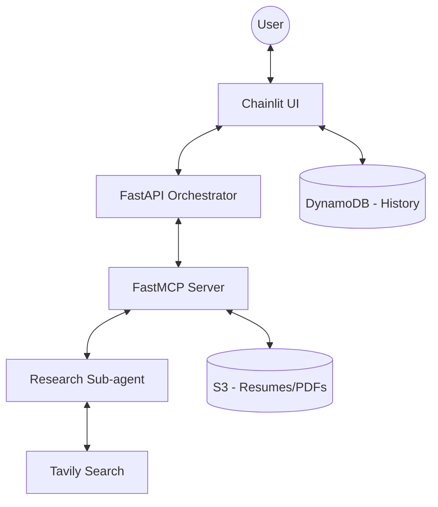

# Interview Prep Agent 🚀

An AI-powered distributed agentic system designed to help users prepare for job
interviews. It analyzes your resume, researches job descriptions, and generates
a personalized preparation strategy.

## 🎯 Project Overview

Preparing for interviews is time-consuming. This tool automates the "deep
research" phase by:

1.  **Parsing your resume** to understand your background.
2.  **Researching the company and role** using real-time web search.
3.  **Generating a PDF strategy guide** with tailored talking points, likely
    interview questions, and company-specific advice.

## 🛠 Tech Stack

- **Frontend:** [Chainlit](https://chainlit.io/) (Python-based UI) with AWS
  Cognito Authentication.
- **Orchestrator Backend:** [FastAPI](https://fastapi.tiangolo.com/) +
  [Pydantic AI](https://ai.pydantic.dev/) (Stateless agent).
- **Tools Layer:** [FastMCP](https://gofastmcp.com/) (Model Context Protocol)
  for decoupling logic from the LLM.
- **Research Sub-agent:** Specialist agent for deep research (Agent-to-Agent
  pattern).
- **LLMs:**
  - **Orchestrator:** Claude Haiku 4.5 (AWS Bedrock) - chosen for its balance of
    speed, complex reasoning and cost-efficiency.
  - **Researcher:** Claude Opus 4.6 (AWS Bedrock) - chosen for superior research
    and synthesis capabilities.
- **Infrastructure:** AWS CDK (Python) deploying to Lambda (Web Adapter), S3,
  DynamoDB, and Cognito.
- **Observability:** [Pydantic Logfire](https://pydantic.dev/logfire) for
  real-time monitoring and debugging of agentic workflows.
- **Package Management:** [uv](https://github.com/astral-sh/uv).

## 🧠 How AI is Used

The project follows an **Actor Model with an Orchestrator and Specialists**:

1.  **Orchestrator (Main Agent):** Acts as the primary interface. It manages the
    conversation state, extracts intent, and decides when to call specialized
    tools via MCP.
2.  **Research Sub-agent:** A specialized agent that "dives deep." It uses the
    **Tavily API** to browse the web, analyze the job description, and
    cross-reference it with the user's resume.
3.  **MCP Tools:** Instead of hardcoding logic, tools like `generate_prep` and
    `upload_resume` are exposed via the Model Context Protocol, allowing the
    agent to interact with the system in a standardized way.

## 🚀 Setup Instructions

### Prerequisites

- [uv](https://github.com/astral-sh/uv) installed.
- Docker & Docker Compose.
- AWS CLI configured with appropriate credentials.
- [Tavily API Key](https://tavily.com/) (must be stored in AWS Secrets Manager
  as `subagent/tavily/api-key`).
- [Logfire Write Token](https://pydantic.dev/logfire) (must be stored in AWS
  Secrets Manager as `logfire/write-token`).

### Local Development

1.  **Clone the repository:**

    ```bash
    git clone <repo-url>
    cd interview-prep
    ```

1.  **Deploy Local Infrastructure:** This creates the necessary S3 buckets,
    DynamoDB tables, and Cognito user pools.

    ```bash
    uv run cdk deploy interview-prep-stack-local -c email=<your-email>
    ```

    _Note: This will generate an output that must be copied to a `local.env`
    file used by Docker Compose._

1.  **Start the Application:**

    ```bash
    docker compose up --build
    ```

1.  **Access the UI:** Open `http://localhost:8000` and log in with your email.

### Production Deployment

The application is designed to be deployed to AWS using the **AWS Cloud
Development Kit (CDK)**. The production stack (`interview-prep-stack`) automates
the provisioning of all necessary resources. An AWS Account and configured
credentials are needed.

#### Deployment Steps

1.  **Bootstrap CDK (if needed):**

    ```bash
    uv run cdk bootstrap
    ```

1.  **Deploy the Production Stack:**

    ```bash
    uv run cdk deploy interview-prep-stack
    ```

1.  **Access the Application:** Once the deployment finishes, the CDK output
    will provide the CloudFront distribution URL (e.g.,
    `https://d123456789abcd.cloudfront.net`).

#### Production Architecture Highlights

- **Serverless Backend:** The Orchestrator, MCP Server, and Research Sub-agent
  are deployed as **AWS Lambda** functions using the **AWS Lambda Web Adapter
  (LWA)**. This ensures high scalability and cost-efficiency.
- **Frontend Hosting:** The Chainlit UI runs on **AWS ECS Fargate**, fronted by
  an **Application Load Balancer (ALB)** and **Amazon CloudFront** for global
  content delivery and SSL termination.
- **Security:**
  - **Authentication:** AWS Cognito handles user sign-up and sign-in.
  - **Authorization:** API Gateway uses a Cognito Authorizer to protect the
    backend. Internal service-to-service communication (e.g., Backend to MCP) is
    secured using **AWS IAM** authentication via Lambda Function URLs.
  - **Secret Management:** Sensitive API keys are never hardcoded and are
    retrieved at runtime from **AWS Secrets Manager**.
- **Observability:** Integrated with **Pydantic Logfire** for end-to-end
  traceability of agentic workflows.

## 🏗 Architecture

> [!NOTE]
> **Architecture Update:** Due to AWS Lambda execution time and state limitations, the current deployment uses a direct FastAPI-based interaction for the Research Sub-agent instead of the `agent.to_a2a()` pattern. Implementing a full Agent-to-Agent (A2A) workflow in a serverless environment would require a dedicated storage layer (for state persistence) and background workers (e.g., a second Lambda function) to manage long-running handovers.



## ⚖️ Trade-offs & Improvements

- **Cold Starts:** Using AWS Lambda for LLM orchestration can lead to cold
  starts. In a high-traffic production environment, Fargate might be preferred
  for the Orchestrator.
- **RAG for History:** Currently, the system uses simple session history.
  Implementing a Vector Database (like Pinecone or Bedrock Knowledge Bases)
  would allow for long-term "memory" of multiple resumes and interview
  experiences.
- **Streaming UI:** While text is streamed, some complex UI artifacts (like the
  PDF preview) wait for the full tool completion. Enhancing the SSE protocol to
  show research progress steps would improve UX.
- **Evals:** Pydantic Evals should be used to track model accuracy. Pydantic
  Evals is a powerful evaluation framework for systematically testing and
  evaluating AI systems, enabling the measurement of performance across
  different model versions and prompt iterations.
- **Testing:** Unit tests for the agentic logic are missing. Adding Pydantic
  AI's `TestModel` would ensure consistent agent behavior.
- **CI/CD:** Implementation of automated workflows via GitHub Actions:
  - **CI (Quality Gate):** Runs linting, unit tests, and Pydantic AI evals on
    every Pull Request to ensure code quality and agent reliability.
  - **CD (Deployment):** Automates `cdk deploy` on every push to `main` to
    synchronize the production environment with the latest verified changes.
